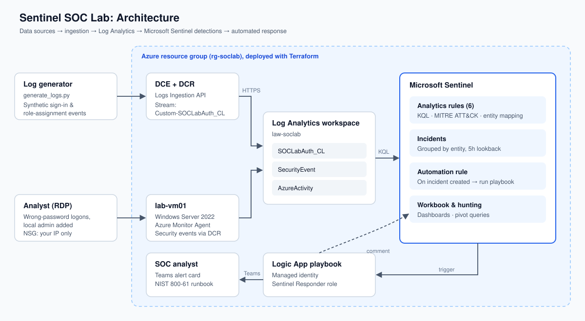
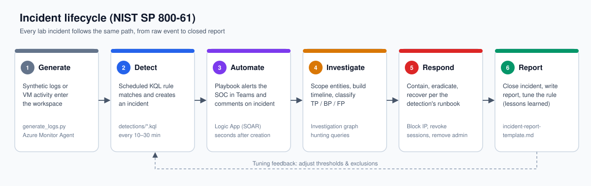
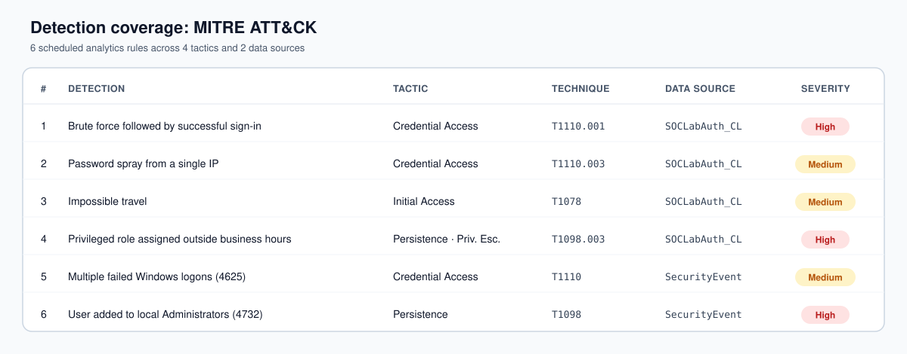

# Microsoft Sentinel SOC Monitoring & Incident Response Lab

A hands-on SOC lab built on Microsoft Sentinel. You deploy a SIEM with Terraform, send it
log data, write KQL detection rules, automate triage with a Logic App playbook, and work
each incident through a NIST 800-61 response process.

All "attack" activity is either **synthetic log rows** (sent to a custom table) or **simple
admin actions on your own lab VM** (typing a wrong password, creating a local user). Nothing
in this lab sends malicious traffic anywhere.

---

## 1. Architecture





## 2. Project layout

```
sentinel-soc-lab/
├── README.md                      ← this guide
├── infra/                         ← Terraform: workspace, Sentinel, DCE/DCR, VM, analytics rules
│   ├── main.tf
│   ├── rules.tf
│   ├── variables.tf
│   ├── outputs.tf
│   └── terraform.tfvars.example
├── detections/                    ← KQL analytics rules (loaded by rules.tf)
├── hunting/hunting-queries.kql    ← ad-hoc threat hunting + dashboard queries
├── generator/                     ← Python synthetic log generator
│   ├── generate_logs.py
│   └── requirements.txt
├── playbooks/notify-and-comment.json   ← Logic App (ARM template)
├── images/                        ← architecture & coverage diagrams
└── docs/
    ├── incident-response-runbook.md
    ├── incident-report-template.md
    ├── reports/INC-SOCLAB-001.md  ← brute-force incident report
    └── scenarios.md               ← step-by-step exercises
```

## 3. Prerequisites

| Item | Notes |
|---|---|
| Azure subscription | Free trial works. You need **Owner** (or Contributor + User Access Administrator) on it. |
| Azure CLI | `brew install azure-cli`, then `az login` |
| Terraform ≥ 1.6 | `brew install terraform` |
| Python ≥ 3.10 | For the log generator |
| (Optional) Microsoft Teams | For playbook notifications |

**Cost:** New Sentinel workspaces get a 31‑day free trial (up to 10 GB/day). The VM
(Standard_B2s) costs roughly $1/day. Run `terraform destroy` when you're done.

## 4. Build steps

### Step 1: Deploy the infrastructure
```bash
cd infra
cp terraform.tfvars.example terraform.tfvars   # edit: subscription_id, your public IP, admin password
terraform init
terraform apply
```
This creates the resource group, the Log Analytics workspace, Sentinel, the custom table
`SOCLabAuth_CL`, the DCE/DCR, a Windows VM with the Azure Monitor Agent, and 6 scheduled analytics rules.

Save the outputs. The generator needs them:
```bash
terraform output
```

### Step 2: Turn on the free data connectors (portal)
Sentinel → **Content hub** → install these solutions, then open each connector:
1. **Azure Activity**: connect your subscription (creates `AzureActivity` logs).
2. **Windows Security Events via AMA**: already handled by Terraform's DCR; verify it shows "Connected".
3. (If you have Entra ID P1/P2) **Microsoft Entra ID**: sign-in & audit logs.

### Step 3: Send synthetic data
```bash
cd ../generator
python3 -m venv .venv && source .venv/bin/activate
pip install -r requirements.txt
export DCE_ENDPOINT="$(terraform -chdir=../infra output -raw dce_endpoint)"
export DCR_IMMUTABLE_ID="$(terraform -chdir=../infra output -raw dcr_immutable_id)"
python generate_logs.py --scenario baseline        # normal traffic
python generate_logs.py --scenario all             # every detection scenario
```
The first ingestion into a new table can take **5–15 minutes** to show up. Check with:
```kql
SOCLabAuth_CL | summarize count() by EventType, Result
```

> The Terraform role assignment lets your signed-in `az` account write to the DCR. RBAC can take
> ~10 minutes to propagate; a `403` right after `apply` usually just means "wait".

### Step 4: Generate real Windows events on the lab VM
RDP to the VM (IP in `terraform output`) and follow `docs/scenarios.md` scenarios 5–6
(wrong-password logons and adding a local admin). These produce `SecurityEvent` rows.

### Step 5: Deploy the playbook
1. In Teams: channel → **Workflows** → template "Post to a channel when a webhook request is received" → copy the URL.
2. Deploy:
```bash
az deployment group create \
  --resource-group "$(terraform -chdir=../infra output -raw resource_group)" \
  --template-file ../playbooks/notify-and-comment.json \
  --parameters teamsWebhookUrl='<your-workflow-url>'
```
3. Sentinel → **Settings → Settings → Playbook permissions** → grant access to the resource group.
4. Sentinel → **Automation → Create → Automation rule**:
   - Trigger: *When incident is created*
   - Condition: Analytics rule name *contains* `SOCLab`
   - Action: *Run playbook* → `pb-soclab-notify-and-comment`

### Step 6: Investigate & respond
Open **Incidents**, then for each one follow `docs/incident-response-runbook.md` and write it up with
`docs/incident-report-template.md`. That write-up is what you put in your portfolio.
See [INC-SOCLAB-001](docs/reports/INC-SOCLAB-001.md) for the brute-force incident report.

### Step 7: Dashboard
Sentinel → **Workbooks → Add workbook → Edit → Add query**. Paste the queries from the
"Dashboard" section of `hunting/hunting-queries.kql` (time chart, top IPs, geo map, incident counts).

### Step 8: Clean up
```bash
cd infra && terraform destroy
```

## 5. Detections included



| # | Rule | Data source | MITRE ATT&CK |
|---|---|---|---|
| 1 | Brute force followed by successful sign-in | SOCLabAuth_CL | T1110.001 Credential Access |
| 2 | Password spray from a single IP | SOCLabAuth_CL | T1110.003 Credential Access |
| 3 | Impossible travel | SOCLabAuth_CL | T1078 Initial Access |
| 4 | Privileged role assigned outside business hours | SOCLabAuth_CL | T1098.003 Persistence |
| 5 | Multiple failed Windows logons | SecurityEvent | T1110 Credential Access |
| 6 | User added to local Administrators | SecurityEvent | T1136.001 / T1098 Persistence |

## 6. Ideas for extending it
- Add a watchlist (`HighValueAccounts`) and raise the severity when a matched user is involved.
- Add threat intel: the **Threat Intelligence** solution plus a TI-map rule against `SourceIP`.
- A second playbook that disables an Entra ID user (needs P1 and Graph permissions).
- Use Sentinel **Repositories** to deploy rules from GitHub (detection-as-code).
- Tune the rules: measure false positives from the baseline scenario and adjust thresholds.

## 7. Resume bullets (once you've built it)
- Deployed Microsoft Sentinel SIEM with Terraform (Log Analytics, DCR/DCE, Azure Monitor Agent).
- Wrote 6 KQL analytics rules mapped to MITRE ATT&CK, with entity mapping and incident grouping.
- Automated incident triage using a Logic App SOAR playbook (Teams alerting + incident enrichment).
- Ran NIST 800-61 incident response on simulated credential-access and persistence incidents and wrote the incident reports.
